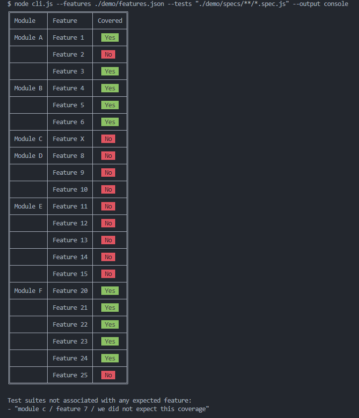
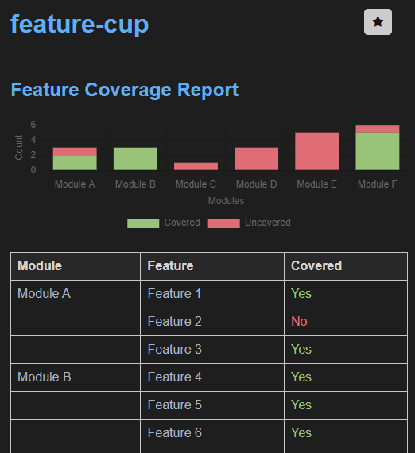

# feature-cup [](https://github.com/oscarcenteno/feature-cup/actions/workflows/nodejs.yml) [](https://coveralls.io/github/oscarcenteno/feature-cup?branch=main) [](https://badge.fury.io/js/feature-cup) [](https://opensource.org/licenses/MIT)

Create feature coverage reports for your test automation system. We are aware that reporting is a key component for test automation suites, however one important question that is usually not answered is "how much of your system is covered byt these tests?".

**feature-cup** allows us to specify the functional structure of the system-under-test and then match the test automation code to the functional structure. The result is a feature coverage report that shows how much of our system is covered by those tests.

Note that feature-cup does not require tests to be ran, as it does a static analysis of the test code.

## Installation

```bash
npm install feature-cup --save-dev
```

## Usage

Find the help by running:

```bash
feature-cup --help
```

Here is a basic usage of the reporter:

```bash
feature-cup --features ./demo/features.json --tests "./demo/specs/**/*.spec.js" --output console
```

### features.json

The features.json file is a json file that contains the system functional structure. It is used to create the feature coverage report. The file is a json array of module objects, such as:

```json
{
  "system": {
    "name": "My System",
    "modules": [
      {
        "name": "Module A",
        "features": [
          {
            "name": "Feature 1",
            "description": "This is feature 1 of module A"
          }
        ]
      }
    ]
  }
}
```

### Tests

The tests are the files that contain the test automation code. They may be written for mocha, jasmine or jest test runners. This reporter will parse all the "describe" blocks in the test files and match them to the features in the features.json file. The reporter will then output the feature coverage report.

The tests are specified using the --tests option. The tests are specified using the glob pattern. For example, to specify all the files in the "specs" folder, use:

```bash
--tests "./specs/**/*.spec.js"
```

In the demo folder, we have the following test files:

``` text
./demo
├──demo.js // usage through a NodeJS file
├──features.json // the functional structure of the system
├──reports
│  ├──feature-coverage-report.html // sample html report
└──specs // the test files
   ├──module_a.spec.js
   ├──module_b // feature-cup will find all test files recursively
   │  ├──module_b.spec.js
   │  ├──module_b_feature_4.spec.js
   │  └──module_b_feature_6.spec.js
   ├──module_c.spec.js
   └──module_f
      └──module_f.spec.js // all "describe" blocks in files will be matched to the features in the features.json file
```


### Output

The output is specified using the --output option. The output can be "console" or "html". 

If the output is "html", then the --report option may be specified. The report option is the path where report will be generated. If not specified, report will be saved in "reports" folder. For example:

```bash
--output console
--output html --report feature-coverage
```

## Examples

Find the source of examples in the "demo" folder.

```bash
# Output report to console
feature-cup --features ./demo/features.json --tests "./demo/specs/**/*.spec.js" --output console
```

will output to the console as:



```bash
# Output report to html file
node cli.js --features ./demo/features.json --tests "./demo/specs/**/*.spec.js" --output html --report feature-coverage
```

will output as an html report at demo/reports/feature-coverage.html:



## Development

### Install dependencies

```bash
npm install
```

### Run tests

Business and presentation logic are covered by unit tests.

```bash
npm test
```

### Run linter

```bash
npm run lint
```

### Run code coverage


```bash
npm run coverage
```

## Contributors

* [Oscar Centeno] (Please report your pull request for revieing bugs or suggestions)

## License

MIT

## References

* [Mocha](https://mochajs.org/)
* [Jasmine](https://jasmine.github.io/)
* [Jest](https://jestjs.io/)
* [Istanbul](https://istanbul.js.org/)
* [Chai](https://www.chaijs.com/)
* [ESLint](https://eslint.org/)
